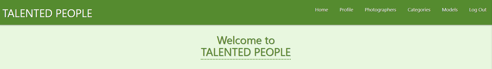

## Code Institute: Milestone Project 3 

Created by Ondrej Valla

[View the deployed website on Heroku.](https://talented-people.herokuapp.com/)
---

## Table of Content
1. [Overview](#overview)

2. [User Experience](#user-experience)
    1. [User Stories](#user-stories)
    2. [Page Structure](#page-structure)
    3. [Page Design](#page-design)
    4. [Images](#images)
    5. [Colours](#colours)
    6. [Icons](#icons)

3. [Wireframes](#wireframes)

4. [Features](#features)
    1. [Existing Features](#existing-features)
    2. [Features left to implement](#features-left-to-implement)

5. [Used Technologies](#used-technologies)

6. [Testing](#testing)
    1. [HTML Validation](#html-validation)
    2. [CSS Validation](#css-validation)
    3. [JavaScript](#javascript)
    4. [Python](#python)
    5. [Performance](#performance)
    6. [Testing User Stories](#testing-user-stories)

7. [Bugs](#bugs)

8. [Deployment](#deployment)

9. [Credits](#credits)
---

## Overview

---
## User Experience

---
## Wireframes

* [Home Page](static/wireframes/home-page.png)
* [Register](static/wireframes/register.png)
* [Login](static/wireframes/login.png)
* [Profile](static/wireframes/profile-portfolio.png)
* [Edit Profile](static/wireframes/edit-profile.png)
* [Photographers/Models Pages](static/wireframes/photographers-page.png)
* [Add Photographer/Add model](static/wireframes/add-photographer.png)
* [Categories](static/wireframes/categories.png)
* [Add Category](static/wireframes/add-category.png)

---
## Features

---
## Used Technologies

---
## Testing

---
## Bugs

1. Navbar buttons for Categories and Models did not work and also were not aligned properly.
   After some investigation, I realized that I have written the code with mistake.  
   When I moved the Anchor closing tags after Categories and Models, issue was sorted.

   
   

---
## Deployment

---
## Credits

---