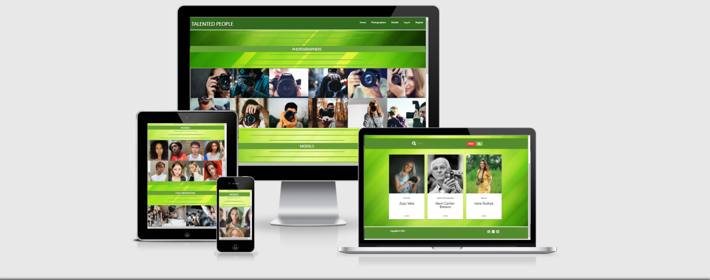
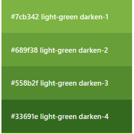

## Code Institute: Milestone Project 3 
## TALENTED PEOPLE

Created by Ondrej Valla

### View [TALENTED PEOPLE](https://talented-people.herokuapp.com/) website on Heroku.
---

# Table of Content
1. [Overview](#overview)

2. [Goals](#goals)

3. [User Experience](#user-experience)
    1. [User Stories](#user-stories)
    2. [Website Structure](#website-structure)
    3. [Website Design](#website-design)
    4. [Images](#images)
    5. [Colors](#colors)
    6. [Icons](#icons)

4. [Wireframes](#wireframes)

5. [Features](#features)
    1. [Existing Features](#existing-features)
    2. [Features left to implement](#features-left-to-implement)

6. [Used Technologies](#used-technologies)

7. [Testing](#testing)
    1. [HTML Validation](#html-validation)
    2. [CSS Validation](#css-validation)
    3. [JavaScript](#javascript)
    4. [Python](#python)
    5. [Performance](#performance)
    6. [Testing User Stories](#testing-user-stories)

8. [Bugs](#bugs)

9. [Deployment](#deployment)

10. [Credits](#credits)
---

# Overview

The TALENTED PEOPLE website is here to allow all users to browse between profiles of Talented Photographers and Talented Models. The primary target audience should be photographers and models of all ages. Secondary audience are all talented people from different industries, planning their project and looking for photographer and models for collaboration. Whether it is make-up artist, hairstyle artist etc., everybody is welcomed and able to browse through profiles. 
Users are able to register and create photographer's or model's profile for all users to view. 

---

# Goals

### User goals:
1. The website to be user-friendly.
2. The website to be visually appealing to users.
3. Easy to navigate website.
4. Ability to register / log in 
5. Registered users can easily Create, Read, Update and Delete as many photographers and models profiles as they like.

### Developer/Admin goals:
1. Have a well designed / responsive website.
2. Get lots of registered users with plenty of photographers / models profiles created.
3. To be able to create / manage photography categories.
4. Use MongoDb database effectively.
---

# User Experience

### User Stories

#### General Site Users 

   As a general site user, 
1. I would like to see content of the page, before I decide whether or not to register.
2. I would like to see the content, be able to browse photographers and models profiles.
3. It would be great if I could search through all profiles, to see if my friends photographers / models are already here.
4. I would like to find out more through social media.
5. I like programing and would like to see this website's repositories.

#### Registered Users  

   As a registered user,
1. I would like to be able to easily register, log in and also log out.
2. I would like to create my profile as a photographer.
3. I would like to create my profile as a model.
4. If I have forgotten some informations while creating my profile, I would like to add them later on.
5. I would like to add some extra images to my portfolio.

#### Admin User

   Me as an Admin user,
1. I would like to be able create new categories.
2. Edit existing categories.
3. Delete categories no longer needed.
4. Be able to manage MongoDb database content.

---

### Website Structure

**Top Navbar** Navbar displays different navigation buttons, depending on the user:
-  Navbar buttons *Displaying to not signed in users* : Home, Photographers, Models, Log In, Register
-  Navbar buttons *Displaying to signed in users* : Home, Photographers, Models, Profile, Log Out
-  Navbar buttons *Displaying Admin user ONLY* : Home, Photographers, Models, Profile, Categories, Log Out

**Home page** Home page is split into four sections from top to bottom, 
- Photographers: *Displaying to All users*: h5 heading and Materialize Slider with images of random photographers.
- Models: *Displaying to All users*: h5 heading and Materialize Slider with images of random models.
- Collaborations: *Displaying to All users*: h5 heading and Materialize Slider with images of random behind the scene collaborations.
-  
    And You: *Displaying to signed in users*: h5 heading with anchor link "AND YOU" taking user to profile.html. Underneath one button See Your Profile.
    
    Join Now: *Displaying to not signed in users*: h5 heading with anchor link "JOIN NOW" taking user to register.html. Underneath two buttons Log In and Register.

**Photographers page** 
- *Displaying to All users*: Photographers page displays Search Bar and Materialize Cards with portfolios of all Photographers in the database.
- *Displaying to not signed in users*: On top of the page is heading "JOIN OUR COMMUNITY" and anchor link "REGISTER NOW" taking user to register.html.
- *Displaying to signed in users*: On top of the page is button Add Photographer linked to add_photographer.html.

**Add Photographer page** Add Photographer page allows *signed in user* to create Photographer's portfolio.
- *Displaying to signed in users*: After clicking on one of Add Photographer buttons, user has an option to create Photographer portfolio. Whether his/her own, if the user is a photographer, or someone else's.
- *Displaying to not signed in users*: If not signed in user get the acces, the header "Add Photographer" and "No Aceess" is shown. The Add Photographer form disappears.

**Edit Photographer page** Edit Photographer page allows *signed in user* to edit Photographer's portfolio created by the same user.
- *Displaying to not signed in users*: If not signed in user get the acces, the header "No Aceess" is shown. The Edit Photographer form disappears.

**Models page** 
- *Displaying to All users*: PModels page displays Search Bar and Materialize Cards with portfolios of all Models in the database.
- *Displaying to not signed in users*: On top of the page is heading "JOIN OUR COMMUNITY" and anchor link "REGISTER NOW" taking user to register.html.
- *Displaying to signed in users*: On top of the page is button Add Model linked to add_model.html.

**Add Model page** Add Model page allows *signed in user* to create Model's portfolio.
- *Displaying to signed in users*: After clicking on one of Add Model buttons, user has an option to create Model portfolio. Whether his/her own, if the user is a model, or someone else's.
- *Displaying to not signed in users*: If not signed in user get the acces, the header "Add Model" and "No Aceess" is shown. The Add Model form disappears.

**Edit Model page** Edit Model page allows *signed in user* to edit Model's portfolio created by the same user.
- *Displaying to not signed in users*: If not signed in user get the acces, the header "No Aceess" is shown. The Edit Model form disappears.

**Profile page**
- *Displaying to signed in users*: Profile page is split into two sections: 

-My Photography Profiles 
    At the beginning, when user has no Photographer Profile created, page shows the message: You don't have any Photographer's Profile created yet! If You wish, create one here. Followed by the button Add Photographer linked to add_photographer.html.

Once the Photographer profile(s) added, the Materialize cards with Photographer's portfolio, Edit and Delete buttons are shown.
    
-My Modelling Profiles
    At the beginning, when user has no Photographer Profile created, page shows the message: You don't have any Model's Profile created yet! If You wish, create one here. Followed by the button Add Model linked to add_model.html.

Once the Model profile(s) added, the Materialize cards with Model's portfolio, Edit and Delete buttons are shown.

- *Not signed in users*: Profile page does not allow access to unregistered / not signed in users. 

**Categories page**
- *Displaying to all users*: If no admin user get access to the Categories page, Categories page displays all photography categories currently existing in the database. With no Add, Edit or Delete functions.
- *Displaying to Admin user ONLY*: For Admin user, Add Category button displays, Edit and Delete buttons on each category card are also displayed / available to use by Admin.

**Register page**
- Register page has three input fields: Your First Name, Your Username, Password.
    If username already exists, flash message show up.
    Underneath of the Register form is the link to login.html for already registered users.

**Log In page**
- Log In page has two input fields: Your Username, Password. 
    If incorect username or password, flash message show up.
    Underneath of the Log In form is the link to register.html for not yet registered users.
---

### Website Design

- The main reason, why I did choose the green theme is because I think the green color is relaxing, therefore believe it could help to deliver good User Experience to website visitors. 
- I have chosen combination of different shades of Green and White background colors, together with Dark green, White and Black text colors.
- Home page image collages together with profile portfolio's images are boosting the whole feel of the website.
- As more users will be adding more images, the variety of colors and images will get bigger and bigger.

### Images

- Website's background image is downloaded from:
[www.teahub.io](https://teahub.io/photos/full/1-19165_full-hd-background-colour.jpg)

- Home Page PHOTOGRAPHERS collages are created from images downloaded from:
[www.google.co.uk/photographers search](https://www.google.co.uk/search?q=photographers&tbm=isch&tbs=rimg:CQ_1ry5nTRpYlYZjmYz63RJa9sgIGCgIIABAA&hl=en&sa=X&ved=0CBwQuIIBahgKEwioqP6Eg_3yAhUAAAAAHQAAAAAQlQE&biw=1519&bih=696)

- Home Page MODELS collages are created from images downloaded from:
[www.models.com/newfaces](https://models.com/newfaces/tag/uk)

- Home Page COLLABORATIONS collages are created from images downloaded from:
[www.google.co.uk/photoshoot behind the scenes search](https://www.google.co.uk/search?q=photoshoot+behind+the+scenes&tbm=isch&ved=2ahUKEwib6cum-oPzAhWP8IUKHb2FBO0Q2-cCegQIABAA&oq=photoshoot&gs_lcp=CgNpbWcQARgAMgcIIxDvAxAnMggIABCABBCxAzIFCAAQgAQyCAgAEIAEELEDMgUIABCABDIFCAAQgAQyBQgAEIAEMgUIABCABDIFCAAQgAQyBQgAEIAEOgQIABBDOgsIABCABBCxAxCDAVDktQ1YzdYNYNLvDWgAcAB4AIABTogBvQaSAQIxM5gBAKABAaoBC2d3cy13aXotaW1nwAEB&sclient=img&ei=XHZDYZvLNo_hlwS9i5LoDg&bih=696&biw=1519&hl=en)

### Colors

- The website's color theme is MOSTLY the combination of different shades of Light green darken 1-4 class of Materialize Color Palette and white-text class.

- [Materialize Color Palette](https://materializecss.com/color.html)

### Icons

- To achieve better appearance and user experience, icons are used in this website.
- The source: [Font Awesome](https://fontawesome.com/)

---

# Wireframes

* [Home Page](static/wireframes/home-page.png)
* [Register](static/wireframes/register.png)
* [Login](static/wireframes/login.png)
* [Profile](static/wireframes/profile-portfolio.png)
* [Edit Profile](static/wireframes/edit-profile.png)
* [Photographers/Models Pages](static/wireframes/photographers-page.png)
* [Add Photographer/Add model](static/wireframes/add-photographer.png)
* [Categories](static/wireframes/categories.png)
* [Add Category](static/wireframes/add-category.png)

---

# Features

### Existing Features

* CRUD functionality

* The website will load and display the Home page (home.html). With the navbar and footer.
* User can browse most of the content, including: Home Page, Photographers Page, Models Page, Log In Page and Register Page without registering or logging in.
* As User is not yet registered or logged in, home page, photographers page and models page are showing hints: Join Us Now, and Register Now, to prompt unregistered / unsigned user to register or log in.
* Once registered and logged in, Profile page comes up and displays flash message: Welcome {user's First name}.
* For active users, Add Photographer and Add Model buttons are displayed in users profiles same as at the top of the photographer.html and the models.html.
* When Portfolio(s) added, Profile page will display all portfolios created by the user, sorted into two groups: Photographers and Models. 
* Existing portfolio(s) card(s), created by the user have two buttons: Edit Button and Delete Button.
* When Edit Button clicked, user is transferred to edit_photographer.html or edit_model.html.
* When Delete Button clicked, delete modal pops up to ensure the user wants to proceed. Yes to delete, No to return.
* photographers.html and models.html displays profiles of Photographers and/or Models stored in the database to all users, regardless whether or not they are registered / logged in. For unregistered users, Join us and Register now headings are displayed. For active users, Add Photographer and Add Model buttons are displayed.
* When individual portfolio card is clicked, the page of photographer.html or model.html is loaded, displaying selected/clicked portfolio (found by the id in the database) with additional informations, filled in during the add_photographer or add_model methods.
* When individual portfolio is being displayed, to the user, if the current user is the same user as created by for selected portfolio, Edit Button and Delete Button are displayed. Once clicked (same as described above).
* Search portfolio feature is available for all users, on photographers.html and models.html.

    photographers.html search bar is searching for photography category and photographer's name.

    models.html search bar is searching for model's name.
Reset button next to search button(magnifying glass icon) reloads both photographers.html and models.html and displays all portfolios again.
* The categories page is only available to the 'admin' user. This page displays all currently created categories in the database. 
The Admin can add, edit and delete the category/categories. 
* Log Out button will log out current user and login.html page will display.

### Features left to implement

* Contact Form
* Uploading image files, directly from the PC or Mobile Phone
* Add the favourite Photographer or the Model to the Favourite list displayed as a favourite group in profile.html

---
# Used Technologies

* [GitHub](https://github.com/) The platform to write the code of this website.
* [Materialize](https://materializecss.com/) My first ever use of this great library to improve grid layout and colors. 
* [MongoDB](https://www.mongodb.com/) Used this database to store user's data.
* [Fask](https://flask.palletsprojects.com/en/2.0.x/) Used Flask framework
* [Font awesome](https://fontawesome.com/) To feature lovely icons, to boost appearance of the website.
* [Favicon](https://favicon.io/) To create TP favicon.
* [Balsamiq](https://balsamiq.com/) Used to create my wireframes.

---
# Testing

---
# Bugs

1. Navbar buttons for Categories and Models did not work and also were not aligned properly.
   After some investigation, I realized that I have written the code with mistake.  
   When I moved the Anchor closing tags after Categories and Models, issue was sorted.

   
   

---
# Deployment

---
# Credits

---